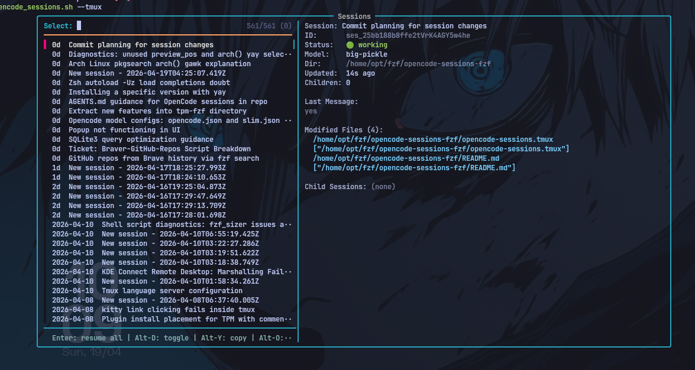
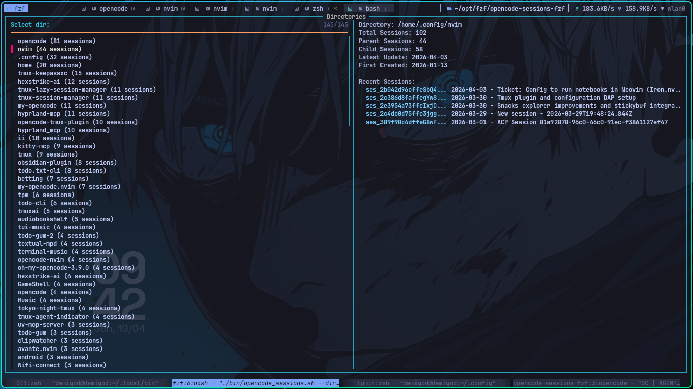

# opencode-sessions

Preview [OpenCode](https://github.com/anomalyco/opencode) sessions with fzf in a tmux popup.




## Installation

### Option 1: TPM (Tmux Plugin Manager)

```bash
# Add to .tmux.conf
set -g @plugin 'den-tanui/opencode-sessions'

# Reload tmux config
tmux source-file ~/.tmux.conf
```

Then press `Prefix + I` to install the plugin.

### Option 2: Run Shell (No TPM)

```bash
# Clone somewhere
git clone https://github.com/den-tanui/opencode-sessions ~/.local/share/tmux/opencode-sessions

# Add to tmux.conf
bind-key -n "o" run-shell -b "~/.local/share/tmux/opencode-sessions/bin/opencode_sessions.sh --tmux --width '80%' --height '80%' --days '7'"
```

## Features

- 🔍 **Fuzzy search** across session titles and directories
- 📁 **Directory view** — group sessions by project directory
- 🎨 **Rich preview** — session metadata, last message, modified files
- 🖥️ **Tmux popup** — press `o` to open sessions in a floating window
- ⌨️ **Keyboard-driven** — full fzf navigation

## Requirements

- **opencode** CLI must have been run at least once to create the database (`~/.local/share/opencode/opencode.db`)
- **fzf** installed (`brew install fzf` or `apt install fzf`)
- **sqlite3** installed

## Without Tmux

Run directly in your terminal:

```bash
# Just sessions
./bin/opencode_sessions.sh

# As directories
./bin/opencode_sessions.sh --directories

# Filter by directory
./bin/opencode_sessions.sh --dir ~/projects/myapp
```

## Quick Start

Press `Prefix + o` (or your custom key) to open the sessions browser.

## Keyboard Shortcuts

| Key      | Action                              |
| -------- | ----------------------------------- |
| `Enter`  | Resume selected session             |
| `Alt+D`  | Toggle sessions ↔ directories view |
| `Alt+Y`  | Copy session ID to clipboard        |
| `Ctrl+O` | Open in new tmux window             |
| `?`      | Toggle preview                      |
| `↑/↓`    | Navigate                            |

## Usage

### Command Line

```bash
# List sessions
./bin/opencode_sessions.sh --list

# Show directories instead of sessions
./bin/opencode_sessions.sh --directories

# Filter by directory
./bin/opencode_sessions.sh --dir /path/to/project

# Limit by days
./bin/opencode_sessions.sh --days 14

# Show all sessions (no time filter)
./bin/opencode_sessions.sh --all

# Run in tmux popup
./bin/opencode_sessions.sh --tmux --width 80% --height 80%
```

### Tmux Options

Configure in `tmux.conf`:

```bash
# Days to show (default: 7)
set -g @opencode-sessions-days "14"

# Popup size (default: 80%)
set -g @opencode-sessions-popup-width "80%"
set -g @opencode-sessions-popup-height "80%"

# Show border (default: false)
set -g @opencode-sessions-popup-border "true"

# Key binding (default: o)
set -g @opencode-sessions-key "s"
```

## Troubleshooting

**No sessions found**

- Make sure you've run opencode at least once
- Use `--all` to show sessions regardless of age

**Popup doesn't appear**

- Check that `@opencode-sessions-key` is set to an unbound key
- Try with `--border` flag to debug

## License

MIT — [GitHub](https://github.com/den-tanui/opencode-sessions)

